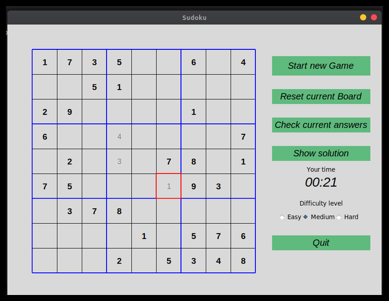

## Games developed with python

- [Snake](#snake)
- [Sudoku](#sudoku)
- [BattleShip](#battleship)
- [Chess](#chess)

##
# Snake
Snake game developed with tkinter. When the player press Start Game button, the game begins, and he must guide the tiny 
snake to get the purple rectangles. Every time the snake gets the purple rectangle, he grows an extra block.
If the snake bumps into the blue edge of the screen or accidentally eats himself the game is over. The more purple blocks
the snake eats the higher the score. 

##
# Sudoku
This game was developed with tkinter. The game arranges numbers in 9 by 9 matrix. The rules are as follow:
- The number in each row and column should by between 1 and 9 and should appear only once.
- The 9x9 matrix is made of nine 3x3 matrices. The number in each of this matrices should also be between 1 and 9 and should appear only once.

This version includes an intuitive interface with the ability to check for errors and show solution.
The most important component of this game is SudokuLogic class where the backtracing algorithm was implemented. We use backtracing to generate random sudoku puzzles and to find the solution.

### Version history
  - Version 1.0
    - Core components created: *Start new game*, *Reset current Board*, *Check current answers*, *Show solution* and *Difficulty level*
    - Created logic of the game: generate random sudoku puzzles and find the soultion
    - Applied styling
    
