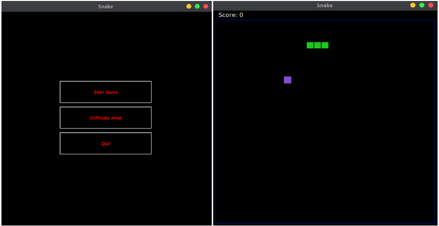

## Games developed with python

- [Snake](#snake)
- [Sudoku](#sudoku)

- [BattleShip](#battleship)
- [Chess](#chess)

##
### Snake

Snake game developed with tkinter. When the player press Start Game button, the game begins, and he must guide the tiny 
snake to get the purple rectangles. Every time the snake gets the purple rectangle, he grows an extra block.
If the snake bumps into the blue edge of the screen or accidentally eats himself the game is over. The more purple blocks
the snake eats the higher the score. 